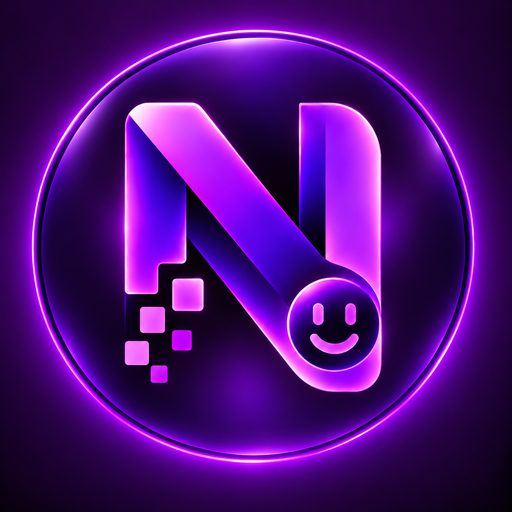
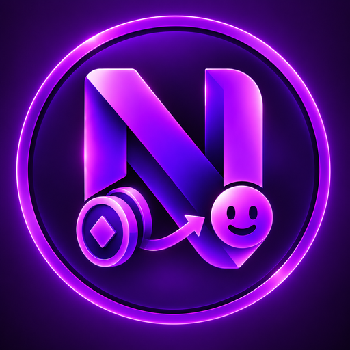

<div align="center">



# Numera Emoji Mapper

**Build Telegram premium custom-emoji packs from any collection of images.**

[](https://github.com/KiaroSama/Numera-Emoji-Mapper/actions/workflows/ci.yml)
[](LICENSE)
[](.github/workflows/ci.yml)
[](docs/GUIDE.md)
<br>
[](worker/README.md)
[](https://core.telegram.org/bots/api)
[](docs/GUIDE.md)
[](https://github.com/KiaroSama/Numera-Emoji-Mapper/commits/main)
<br>
[](https://github.com/KiaroSama/Numera-Emoji-Mapper/commits/main)
[](https://github.com/KiaroSama/Numera-Emoji-Mapper)
[](https://github.com/KiaroSama/Numera-Emoji-Mapper)
[](requirements.txt)
[](requirements.txt)
[](docs/GUIDE.md)
[](worker/README.md)
[](#donate)

</div>

Numera Emoji Mapper started as a crypto-coin logo packer and is now a general tool: it
takes a folder of images, normalizes each one to the exact 100×100 PNG that
Telegram custom emoji require, and uploads them through a bot into one or more
custom-emoji sets owned by your account.

It ships with two independent workflows that share the same engine:

| | Workflow | Bot | Source | Purpose |
|---|----------|-----|--------|---------|
|  | **Crypto coins** | `TELEGRAM_BOT_TOKEN` | CoinGecko / CoinPaprika / CoinMarketCap logos | the original coin-logo packs |
|  | **General** | `GENERAL_BOT_TOKEN` (`@YourEmojiBot`) | any folder of images you provide | any non-coin emoji pack |

The same scripts (`emojikit/make_emoji_pngs.py` + `emojikit/build_pack.py`) power both; only the
source folder and the selected bot token differ.

> 📘 **[Full Guide (0 → 100) — docs/GUIDE.md](docs/GUIDE.md)** — complete
> reference for every workflow and command, written for humans and AI agents.

## How it works

1. **Prepare PNGs** — `emojikit/make_emoji_pngs.py` converts your images (SVG, PNG, JPG,
   WEBP, GIF) into transparent 100×100 PNGs.
2. **Build the pack** — `emojikit/build_pack.py` uploads those PNGs into Telegram
   custom-emoji sets (max 200 per set), naming them `<base><n>_by_<botusername>`
   and sending you each finished pack's `https://t.me/addemoji/...` link.

## Requirements

- Python 3.11+
- A Telegram bot (create one with [@BotFather](https://t.me/BotFather))
- Your numeric Telegram user id (the pack owner) — press **Start** on the bot once
- Dependencies in `requirements.txt` (`pip install -r requirements.txt`) — this
  is the **core** set (requests, Pillow, resvg-py, rlottie-python) and is all the general
  workflow needs. The coin tool `coins/remap_ids.py` additionally needs numpy,
  which lives in `requirements-coins.txt` (a ~20 MB wheel nobody building
  ordinary packs has to install)
- **ffmpeg + ffprobe** on `PATH` — only required for **video** emoji (`.webm`).
  Install on Windows with `winget install Gyan.FFmpeg`. Static and animated
  workflows do not need it.

## Setup

```powershell
# 1. Create a virtual environment and install deps
py -3.11 -m venv .venv
.venv\Scripts\python.exe -m pip install -r requirements.txt
# working on the crypto-coin component too? add the coin extra:
# .venv\Scripts\python.exe -m pip install -r requirements-coins.txt

# 2. Configure secrets
copy .env.example .env
# then edit .env and fill in the tokens / owner id
```

`.env` keys (see `.env.example`):

```
PACK_OWNER_USER_ID=<your numeric telegram id>
TELEGRAM_BOT_TOKEN=<coin bot token>
GENERAL_BOT_TOKEN=<general bot token>      # @YourEmojiBot
CMC_API_KEY=<optional CoinMarketCap key>
```

Your own identities — which bots lead their packs with your brand logo, the
logo itself, your pack bases and coin pack title — are `.env` keys too
(`BRAND_LOGO_BOTS`, `BRAND_LOGO_PATH`, `COLLECTION_PACK_BASE`, `COIN_PACK_BASE`,
`COIN_PACK_TITLE`, …). The repository names no operator, so none has a default:
a tool that needs one stops and names it. Keep your logo in the git-ignored
`private/` folder.

## Quick start — general emoji pack (new bot)

Run module commands from the project root; `run.ps1` sets that directory for you.

```powershell
# Put your source images in a folder, e.g. input/myset/
.venv\Scripts\python.exe -m emojikit.make_emoji_pngs --in input\myset --out build\myset

# Validate without calling Telegram
.venv\Scripts\python.exe -m emojikit.build_pack --base myset --title "My Emojis" `
    --source-dir build\myset --token-env GENERAL_BOT_TOKEN --emoji "😀" --dry-run

# Build for real
.venv\Scripts\python.exe -m emojikit.build_pack --base myset --title "My Emojis" `
    --source-dir build\myset --token-env GENERAL_BOT_TOKEN --emoji "😀"
```

Optional: pass `--keywords path\to\keywords.csv` (columns `ticker,...,keywords`)
to attach searchable keywords to each emoji. Without it, the file name is used.

## `emojikit/build_pack.py` options

| Option | Default | Description |
|--------|---------|-------------|
| `--base` | *(required)* | set-name base (letters/digits/_) |
| `--title` | *(required)* | human-readable set title |
| `--source-dir` | `logos/emoji` | folder of 100×100 PNGs to upload |
| `--token-env` | `TELEGRAM_BOT_TOKEN` | env var holding the bot token |
| `--keywords` | `auto` | keywords CSV; `auto` = coin list only for the default source |
| `--emoji` | 🪙 | associated standard emoji |
| `--user-id` | `PACK_OWNER_USER_ID` | numeric owner id |
| `--per-set` | 200 | emojis per set; 1–200 only (Telegram's cap), higher is a usage error |
| `--limit` / `--start` | 0 / 0 | process a slice of the source |
| `--state` | `state_<base>.json` | resume file (per pack, never clobbered) |
| `--dry-run` | off | validate inputs without calling Telegram |

Runs are **resumable**: progress is saved to `state_<base>.json`, so an
interrupted or flood-limited run continues without recreating existing sets.

## Collecting & republishing packs (multi-format)

The collector workflow downloads emoji from existing Telegram packs (and/or
builds them from scratch from your own files), deduplicates everything into a
persistent catalog, and republishes them into new packs with your own name and
labels. It supports all three custom-emoji formats — **static** (PNG/WEBP),
**animated** (`.tgs` Lottie) and **video** (`.webm` VP9).

### Animated vs. video — and how detection works

| | Animated (`.tgs`) | Video (`.webm`) |
|---|---|---|
| Nature | vector Lottie animation (gzip JSON) | VP9 pixel video |
| Cap | ≤ 64 KB | ≤ 256 KB, ≤ 3 s, 30 fps, no audio |
| `format` | `animated` | `video` |
| Build from | Lottie JSON/TGS only | any GIF/MP4/WEBM/image (ffmpeg) |

Detection is automatic: from the Bot API a sticker's `is_animated` / `is_video`
flags decide the format; downloaded files are also verified by magic bytes
(`1F 8B`→tgs, `1A 45 DF A3`→webm, PNG/RIFF-WEBP→static). A GIF or video **cannot**
become an *animated* emoji (those are vector-only) — it becomes a *video* emoji.

### Duplicate-proof by design

The old delete-and-rebuild churn is gone. The catalog (`collection/catalog.db`)
deduplicates at **ingest** time, not after publishing:

1. **`file_unique_id` pre-check** — a sticker already ingested is never
   downloaded again. Publishing also records the uploaded copies'
   `file_unique_id`s, so re-fetching your **own** published packs downloads
   nothing.
2. **Normalized content hash** — identical media from different packs collapse
   into one entry (their emoji/keywords/sources merge).
3. **Perceptual hash (dHash)** — near-identical logos merge within a threshold
   (opt-in via `--phash-threshold`; off by default so distinct look-alikes
   survive).
4. **Idempotent publish** — uploaded items are tracked per item; before
   uploading, the live set is reconciled and any applied-but-unrecorded sticker
   is attributed back to its catalog item, so interruptions can never create
   duplicates.
5. **Verified network retries** — a timeout after Telegram already processed an
   `addStickerToSet` is detected against the live set and never re-sent, so the
   same emoji can't land in a pack twice.

### Commands

```powershell
# 1. Download from one or more existing packs into the catalog
.venv\Scripts\python.exe -m emojikit.fetch_pack https://t.me/addemoji/somepack_by_bot `
    --token-env GENERAL_BOT_TOKEN

# 2. (optional) Build extra emoji from your own files (auto static/video/animated)
.venv\Scripts\python.exe -m emojikit.add_media --in input\myset --emoji 😀

# 3. Preview, then publish into new per-format packs (resumable)
.venv\Scripts\python.exe -m emojikit.build_collection --base mypack --title "My Pack" `
    --token-env GENERAL_BOT_TOKEN --dry-run
.venv\Scripts\python.exe -m emojikit.build_collection --base mypack --title "My Pack" `
    --token-env GENERAL_BOT_TOKEN
```

Sets are named `<base>s<n>_by_<bot>` (static), `<base>v<n>_by_<bot>` (video) and
`<base>a<n>_by_<bot>` (animated). All working data lives under `collection/`
(gitignored).

> Re-publishing other people's emoji under a new name may raise ownership /
> copyright concerns — only collect content you have the right to use.

## Numera Emoji Mapper bot (premium-emoji ID extractor)

`emojikit/emoji_bot.py` runs the general bot interactively (long-polling) and extracts
premium custom-emoji IDs with tap-to-copy buttons (Telegram `copy_text`):

- Send the bot a **premium emoji** → it replies with the ID on a copy button.
- Send/forward a **post mixing text + premium emoji** → it lists every ID;
  tapping a button copies them.
- **Add it to a channel/group** (as admin) → it DMs you the premium-emoji IDs
  from new posts. (Bots cannot read past channel history, only new posts.)

```powershell
.venv\Scripts\python.exe -m emojikit.emoji_bot     # or run.ps1 -> C1
```

## Cloudflare Worker (both bots, hosted)

`worker/` runs the same bot behaviour on Cloudflare instead of your machine —
both bots in one Worker, each on its own path (`/tg/general`, `/tg/coin`) with
its own webhook secret, answering only the ids in `ADMIN_USER_IDS`. It also
exposes `POST /publish`, so a finished pack is announced **by the bot** in your
channel rather than by this machine: set `WORKER_PUBLISH_URL` and
`WORKER_PUBLISH_SECRET` in `.env` and **all three publishers** — `emojikit/build_pack.py`,
`emojikit/build_collection.py` and `coins/rebuild_dedup.py` — route their links through
it. Leave either unset and the existing direct path is used, unchanged.

It keeps its own log: a D1 table of warnings, errors and publishes, capped at the
newest 5 000 rows, plus an errors-only Telegram channel; routine lines go to
Workers Logs only, so a message to a bot costs no D1 write. Every line starts with the bot that wrote it,
because both bots share the Worker, the table and the channel.

> **A Telegram bot token can use `getUpdates` (polling) or a webhook — never
> both.** Registering a webhook for a token stops `emojikit/emoji_bot.py` receiving
> anything on it; `deleteWebhook` hands it back. Run one or the other per token.

Setup, secrets and deployment: [`worker/README.md`](worker/README.md).

```powershell
cd worker
npm install
.\scripts\put-secrets.ps1                       # from .env, nothing printed
npx wrangler deploy
.\scripts\set-webhooks.ps1 -BaseUrl https://<your-worker>.workers.dev
```

## Curate panel (pick which emoji go into the pack)

`emojikit/panel.py` opens a local dark neon-blue web panel showing every emoji in the
catalog as a large labelled card. All cards are selected by default; click one
to toggle it (deselected = excluded from the next publish), Shift+click for a
range, **drag** to set the publish order — each card shows its position,
and dragging to the top or bottom edge scrolls the page so you can move an
item across the whole catalog in one go. **Click the `premium-id:` label
to copy that id** to the clipboard — it does not toggle the card. Visually similar emoji start out next
to each other so look-alikes are quick to deselect. Click **Save**, then
`emojikit/build_collection.py` only publishes the included items.

**The grid is virtual**: only the rows near the viewport exist in the page,
whatever the catalog holds, so a thousand cards scroll and drag like a
hundred. **Zoom** with the `−` / `100%` / `+` buttons, Ctrl+wheel or
Ctrl+plus/minus (Ctrl+0 resets) — out to fit more emoji per screen, in to
inspect one; below 75 % the text under each thumbnail is dropped so the rows
pack tighter. The level is remembered across reloads.

**Selection mode** shows only the pick checkbox. Shift-click picks the whole
range from the last anchor; Select all / Deselect all / Invert act on picks.
**Hold** removes picked cards from the grid and pack counts. Each held card has
**Unhold**, and **Unhold all** restores the group. A full original pack produces
a capacity error without releasing any conflicting cards.

**Undo/Redo** covers picking, inclusion, hold/unhold, dragging, zoom, animation
and backdrop. **Reset all** restores this page's last successful explicit Save
checkpoint; Reset is undoable. Order continues to auto-save, while inclusion
changes require Save. Older replies never acknowledge edits made after a Save.
A failed request retains the draft; transient failures retry, and a permanently
rejected body waits for a changed request. **Export draft** preserves a local
JSON copy if reconciliation is needed.

Animated previews use browser-native WebP. At compact zoom, ordinary-density
screens use 72px previews and at most 10fps; larger tiles use 104px. The server
runs at most two uncached preview renders at once. Off-screen and header-covered
animations stop, and switching animation off releases video decoders in favor
of still posters. The source media and published files are unchanged.

Panel actions and browser error locations join the normal UTC `logs/panel_*.log`
file. Event fields contain counts, revisions, status and source locations;
tokens, labels, media IDs and arbitrary error text are excluded. Log delivery
is bounded and does not block saving.

```powershell
.venv\Scripts\python.exe -m emojikit.panel        # or run.ps1 -> B4
.venv\Scripts\python.exe -m emojikit.panel --preview-fps 12
# Branding without a Telegram username lookup:
.venv\Scripts\python.exe -m emojikit.panel --bot-username YourEmojiBot
```

B4 reopens an existing panel on the requested port instead of starting a second
server. Its current session and unsaved work stay active. A different service
on that port is refused; use another port for a separate panel session.

## Crypto-coin workflow (one component: `coins/`)

The crypto-coin tool is now a self-contained component under `coins/`. It reuses
the shared engine in the package (`emojikit/build_pack.py`) and the coin bot
(`TELEGRAM_BOT_TOKEN`). Its data, scripts and images all live under `coins/`:

- `coins/fetch_logos.py` — download coin logos from CoinGecko + write `coins/keywords.csv`
- `coins/fetch_paprika.py` / `coins/fetch_cmc.py` — fill remaining coins from CoinPaprika / CoinMarketCap
- `coins/build_keywords.py` — (re)build `coins/keywords.csv` from logos on disk
- `coins/rebuild_dedup.py` — duplicate-proof full rebuild + inventory fill
- `coins/remap_ids.py` — rebuild `ticker_to_id.json` from image content, never positions
- `coins/enhance_map.py` / `coins/alias_map.py` — point chain-variant tickers at the base coin's id
- `coins/verify_logos.py` — review logos against official art; fix only the tickers you name
- `coins/write_manifests.py` — write a per-pack manifest (ticker + emoji id)
- `coins/check_all_packs.py` — audit every pack for blank/duplicate stickers
- `coins/run_convert.ps1` / `coins/run_rebuild_loop.ps1` — watchdog drivers for long runs

Extra dependency: `coins/remap_ids.py` imports numpy —
`pip install -r requirements-coins.txt`. Every other coin script runs on the core
manifest alone.

Convert coin logos to 100×100 PNGs (images live in `coins/logos/{svg,png}` →
`coins/logos/emoji`):

```powershell
.venv\Scripts\python.exe -m emojikit.make_emoji_pngs --in coins\logos\svg --out coins\logos\emoji
.venv\Scripts\python.exe -m emojikit.make_emoji_pngs --in coins\logos\png --out coins\logos\emoji
```

Then build/rebuild with the coin bot:

```powershell
# build + rebuild the id map + send the links (DESTRUCTIVE: deletes the old packs
# first). Subcommands: build = upload only, map = rebuild the id map, links = resend.
.venv\Scripts\python.exe coins\rebuild_dedup.py
```

## Project layout

```
Numera Emoji Mapper/                  # the whole project
  emojikit/                    # command modules and shared toolkit
    build_pack.py                # core engine: upload any source dir with any bot
    make_emoji_pngs.py           # core engine: image -> 100x100 PNG (--in/--out)
    fetch_pack.py                # collector: download Telegram packs -> catalog
    fetch_emoji_ids.py           # collector: download specific emoji by id -> catalog
    add_media.py                 # collector: build emoji from scratch -> catalog
    build_collection.py          # collector: publish catalog -> new packs
    sync_order.py                # reorder a LIVE pack to match the panel
    pack_archive.py             # archived media reconciliation
    pack_manifest.py            # pack roster and gallery CLI
    panel.py                     # curate panel: the server, the page, the APIs
    emoji_bot.py                 # bot: extract premium-emoji ids (tap-to-copy)
    telegram_api.py           # the Bot API client + Telegram's caps
    operator_config.py        # your identities from .env (no defaults)
    packstate.py              # state-file shape + atomic write + pack lock
    announce.py               # announce finished packs (Worker, or direct)
    collection_state.py       # its plan/resume state + the brand logo
    collection_reconcile.py   # what is live in a set, and whose key it is
    collection_preflight.py   # --preflight: ask Telegram to validate the queue
    collection_migrate.py     # move EVERY reference to a content key, as one change
    panel_view.py             # the panel's view model (build_view, ordering)
    pack_gallery.py           # self-contained pack gallery rendering
    ingest.py                 # verified dedup and collision-safe media storage
    panel_preview.py          # bounded, sized thumbnail cache
    panel_logging.py          # validated, bounded browser event logs
    logsetup.py                # UTC file logging
    media.py                   # format detect + static/video/tgs convert
    video_decode.py            # the video decoder choice + a frame cache
    repaint.py                 # bake a tint into a Lottie or a static
    identity.py                # content keys, perceptual hashes, same_image
    catalog.py                 # content-addressed SQLite catalog (dedup)
    maintenance.py             # canonical catalog writer/maintenance ownership
    migration_bundle.py        # verified media intents and application rollback
    errors.py                  # the media exception types (a leaf: no cycle)
  worker/                      # Cloudflare Worker: both bots + /publish (TypeScript)
    src/                       # auth, telegram, emoji-id extraction, routing
    test/                      # vitest, fetch stubbed (never reaches Telegram)
  assets/                      # the project's own images + the panel page and its scripts
  run.ps1                      # launcher (single-pack + collection workflows)
  scripts/check.ps1            # byte-compile + full unit suite (also used by CI)
  scripts/identity_repair.py   # report/migrate/recover/restore catalog identity
  requirements.txt
  requirements-dev.txt         # test-only: ruff + playwright (never at runtime)
  .env.example                 # configuration template
  README.md  LICENSE                # CONTRIBUTING/SECURITY live in .github/
  tests/                       # unit tests + fixtures (see tests/README.md)
  coins/                       # ONE component: the crypto-coin emoji tool
    fetch_*.py                 # coin logo fetchers (CoinGecko/Paprika/CMC)
    build_keywords.py
    rebuild_dedup.py           # duplicate-proof rebuild + inventory fill
    check_all_packs.py         # pack integrity audit
    run_convert.ps1 run_rebuild_loop.ps1
    keywords.csv               # coin ticker -> keywords (curated input)
```

Generated/local-only (gitignored): `logos/` (and `coins/logos/`), `build/`,
`input/`, `collection/`, `packs/`, `*_state.json`, `*.filled.md`, `.env`,
`secrets.md`. The coin component's own map and inventory
(`coins/ticker_to_id.json`, `coins/currency-emoji-inventory.md`,
`coins/shared_logo_groups.json`, `coins/unresolved_logos.json`) are local-only
too: this repository ships the tool that builds emoji packs, not anybody's
published packs, and those files name live custom-emoji ids. They are rebuilt
from Telegram by `coins/rebuild_dedup.py map`.

## Checks

One command byte-compiles every source file, lints it, and runs the whole unit
suite — the same one CI runs, so local and CI results cannot drift:

```powershell
python -m pip install -r requirements-dev.txt   # once; never runtime deps
python -m playwright install chromium           # once; the panel's browser suite
.\scripts\check.ps1
.\run.ps1 -Check      # separate: environment doctor (venv/deps/ffmpeg/.env)
```

`tests/test_panel_browser.py` drives the real panel in headless Chromium and
**raises** rather than skipping when playwright or Chromium is missing — a
browser test that reports green on a machine with no browser is worse than
none. `NUMERA_EMOJI_MAPPER_NO_BROWSER_TESTS=1` opts out deliberately; CI does that in
the Python matrix and runs the module in its own job instead.

Lint is `ruff check .` with **no** arguments: `ruff.toml` at the repo root owns
the rule set, so nothing can diverge between CI and a local run. That set is
deliberately narrow — ruff's default rules plus `E402`, `BLE001`, `B` and
`RUF100` — because the source already carried ~120 `# noqa: E402` /
`# noqa: BLE001` comments written against a linter that was never configured.
Enabling exactly the codes those comments name is what makes them mean
something, and `RUF100` fails a `# noqa` that no longer suppresses anything, so
they cannot rot again.

Running the suite by hand? Use exactly this form:

```powershell
.venv\Scripts\python.exe -m unittest discover -s tests -t . -p "test_*.py"
```

`-t .` is not cosmetic. Without it the tests directory becomes the top level,
modules load as `test_x` instead of `tests.test_x`, and `tests/__init__.py` —
which scrubs credentials out of the environment and refuses non-loopback sockets
— never runs. See [`tests/README.md`](tests/README.md).

## Security

Tokens and the owner id live only in `.env` (never committed) and are read at
runtime. See [SECURITY.md](.github/SECURITY.md). Revoke a leaked token via @BotFather
and update `.env`.

## License

Numera Emoji Mapper — builds Telegram premium custom-emoji packs.
Copyright (C) 2026 KiaroSama

This program is free software: you can redistribute it and/or modify it under
the terms of the **GNU General Public License** as published by the Free
Software Foundation, either version 3 of the License, or (at your option) any
later version. See [LICENSE](LICENSE) for the full text.

This program is distributed in the hope that it will be useful, but WITHOUT ANY
WARRANTY; without even the implied warranty of MERCHANTABILITY or FITNESS FOR A
PARTICULAR PURPOSE. See the GNU General Public License for more details. If you
did not receive a copy along with this program, see
<https://www.gnu.org/licenses/>.

The GPL covers this project's own source. Third-party logos and data keep their
own providers' licenses, which the GPL does not and cannot change (see below).

## Sources & attribution

Coin vector logos come from open icon sets
([spothq/cryptocurrency-icons](https://github.com/spothq/cryptocurrency-icons),
[Cryptofonts/cryptoicons](https://github.com/Cryptofonts/cryptoicons)); raster
logos from [CoinGecko](https://www.coingecko.com/),
[CoinPaprika](https://coinpaprika.com/) and
[CoinMarketCap](https://coinmarketcap.com/). Respect each source's license and
terms when redistributing. For general packs, only use images you have the right
to use.

## Donate

If this project helps you, donations are appreciated.

| Currency | Network | Address |
| --- | --- | --- |
| Bitcoin (BTC) | Bitcoin | `bc1qmth5m03pu5hujw5xw5jmywam3jj3sqwqupesdt` |
| USDT, BNB, USDC, etc. | BEP20 | `0x0Bd0BA443a8B9cf15922bf7f0Bb0a4b495fD06Ef` |
| USDT, TRX, USDC, etc. | TRC20 | `TWBA3xFTqgZAeAYMxqo85xWnzvty3DcAhw` |
| Ethereum (ETH) | ERC20 | `0x0Bd0BA443a8B9cf15922bf7f0Bb0a4b495fD06Ef` |
| TON | TON | `UQCN8Umo_OfOWqImZetQsrNStPcmLkMAKajFyiCOhso23NDb` |
| Litecoin (LTC) | LTC | `ltc1qntqnnrunadurnw4cshv3qgspywrueyyeyngwuy` |
| Solana (SOL) | Solana | `7B2wkczUjmkDhETwQuknBL8sUsbuV7nErxc317TmQuwR` |
| Polygon (POL) | Polygon | `0x0Bd0BA443a8B9cf15922bf7f0Bb0a4b495fD06Ef` |
