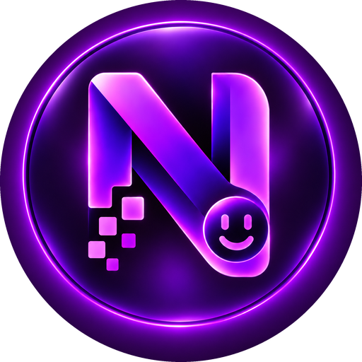
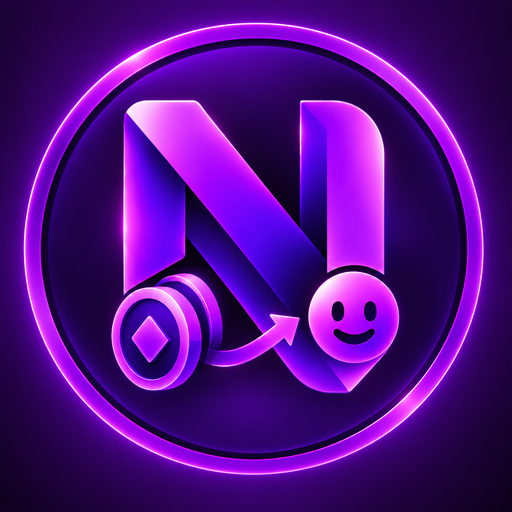
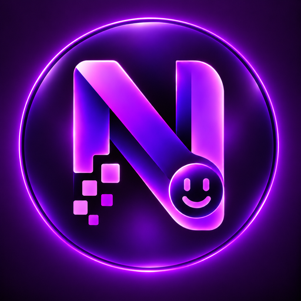

<div align="center">



# Numera Emoji Mapper

**Build Telegram premium custom-emoji packs from any collection of images.**

[](.github/workflows/ci.yml)
[](LICENSE)
[](CHANGELOG.md)
[](tests/fixtures/migration/reference-cases.json)
[](rust-toolchain.toml)
[](.github/workflows/release.yml)
[](.github/workflows/release.yml)
[](docs/GUIDE.md)
[](README.md)
[](runtime/Cargo.toml)
[](docs/GUIDE.md)
[](runtime/Cargo.toml)
[](worker/README.md)
[](#donate)

</div>

Numera Emoji Mapper started as a crypto-coin logo packer and is now a general tool: it
takes a folder of images, normalizes each one to the exact 100×100 PNG that
Telegram custom emoji require, and uploads them through a bot into one or more
custom-emoji sets owned by your account.

It ships with two independent workflows that share the same engine:

| | Workflow | Bot | Source | Purpose |
|---|----------|-----|--------|---------|
|  | **Crypto coins** | `TELEGRAM_BOT_TOKEN` | CoinGecko / CoinPaprika / CoinMarketCap logos | the original coin-logo packs |
|  | **General** | `GENERAL_BOT_TOKEN` (`@YourEmojiBot`) | any folder of images you provide | any non-coin emoji pack |

The installed Rust commands `make-emoji-pngs` and `build-pack` power both;
only the source folder and selected bot token differ. The Rust CLI, panel and
bounded media worker use native raster, SVG, Lottie and video implementations.
The production dependency graph and ready-built archives require no Python,
Python packages, virtual environment or Rust compiler. FFmpeg/FFprobe remain
external tools for video.

All first-party application code, contributor commands and backend tests use
Rust 1.100.0. The browser panel keeps JavaScript/HTML/CSS, and the Cloudflare
Worker keeps TypeScript. Ready-made native codec dependencies are statically
linked where appropriate; their source and redistribution notices are retained.

Every push and pull request builds the application and runs unfiltered Rust
acceptance on **Linux x64 and Windows x64**. Browser acceptance and Worker checks
run in separate jobs. macOS, ARM and 32-bit targets are outside this release.
The original 1,516 discovered application cases have an explicit migration
inventory; browser cases retain their original browser/source-contract categories.
See [test ownership](docs/native-test-migration.md) and
[CI policy](docs/rust-ci-status.md) for the exact gates and platform skips.
The [upstream refresh](docs/upstream-refresh.md) records the adopted dependency
versions and renderer and logo-source review.

> **[Full Guide (0 to 100): docs/GUIDE.md](docs/GUIDE.md)**: complete
> reference for every workflow and command, written for humans and AI agents.

## How it works

1. **Prepare PNGs:** `make-emoji-pngs` converts your images (SVG, PNG, JPG,
   WEBP, GIF) into transparent 100×100 PNGs.
2. **Build the pack:** `build-pack` uploads those PNGs into Telegram
   custom-emoji sets (max 200 per set), naming them `<base><n>_by_<botusername>`
   and sending you each finished pack's `https://t.me/addemoji/...` link.

## Requirements

- **Prebuilt packages:** the standalone executable and its bundled assets. No
  Python, virtual environment, Cargo or C++ toolchain is needed to run it.
- **Package targets:** Windows x64, Linux x64 (Ubuntu 24.04+ / glibc 2.39+),
  with x86_64 CPUs. Each download must pass its hosted native
  package and media checks. Alpine/musl and other CPU targets are not covered.
- A Telegram bot from [@BotFather](https://t.me/BotFather), and your numeric
  Telegram user id. Press **Start** on the bot once before publishing.
- **ffmpeg + ffprobe** on `PATH` for video emoji (`.webm`). On Windows:
  `winget install Gyan.FFmpeg`. Static images and Lottie do not require them.

## Install a ready-built package

Prebuilt 64-bit packages ship for four targets: `windows-x64`, `windows-arm64`,
`linux-x64`, and `linux-arm64` (no macOS or 32-bit builds).

1. Open [Releases](https://github.com/KiaroSama/Numera-Emoji-Mapper/releases) (or
   the artifacts on a successful [Prebuilt packages run](https://github.com/KiaroSama/Numera-Emoji-Mapper/actions/workflows/release.yml))
   and download the matching `numera-emoji-mapper-<version>-<platform>.zip` plus
   `SHA256SUMS`, `SHA256SUMS.asc`, and `KEYS.asc`. A source ZIP is not a ready-built
   application.
2. Verify the detached GPG signature (`gpg --import KEYS.asc && gpg --verify SHA256SUMS.asc SHA256SUMS`),
   the archive SHA-256 checksum, GitHub build provenance attestation (`gh attestation verify`),
   and on Windows the executable's Authenticode signature (`Get-AuthenticodeSignature .\numera-emoji.exe`),
   then extract the archive into its own directory.
3. Run the executable directly. The extracted directory is already runnable;
   there is no dependency installation step.

**Windows:**

```powershell
.\numera-emoji.exe package-verify
.\numera-emoji.exe doctor
.\numera-emoji.exe menu
```

**Linux:**

```bash
chmod +x numera-emoji
./numera-emoji package-verify
./numera-emoji doctor
./numera-emoji menu
```

`numera-emoji doctor` checks the installed application. Use `numera-emoji menu`
for the interactive menu, `numera-emoji panel` for the browser panel, or `--help`
for commands. The executable runs directly; there are no shell launchers.
Copy `.env.example` to `.env` and fill in your configuration before contacting
Telegram. Runtime temp/cache files stay in `logs/tmp/` and `.cache/` beside the
application.

Each archive includes [third-party notices](THIRD_PARTY_NOTICES.md) and the
bundled renderer's original license and provenance files under `licenses/rlottie/`.
These files are covered by the package's SHA256 inventory.

An optional `install-prebuilt --destination /absolute/path/to/new-directory`
command copies and verifies the whole package. It uses an exclusive installation
lock and preserves the previous directory if replacement fails. Successful
replacements retain the previous directory for recovery as well: a running
application can still hold file handles into it. An existing
installation containing local data or configuration is refused: extract updates
separately and keep your `.env` and collections backed up. Hash checks and
linked/path traversal refusals apply before installation.

### Developer source build

Production contributors need the pinned Rust 1.100.0 toolchain, CMake and a platform C/C++ linker (MSVC
build tools on Windows). Python is unnecessary for this build:

```bash
cargo build --manifest-path runtime/Cargo.toml --locked --release --bins
runtime/target/release/numera-emoji --help
```

On Windows, use `runtime\target\release\numera-emoji.exe`. To package it:

```bash
runtime/target/release/numera-emoji package-native --out dist --revision YOUR_COMMIT
```

Contributor commands are also Rust: `numera-dev build`, `check`, `test`,
`panel-sandbox` and `benchmark-similarity`. They keep temporary files in the
project, own child process trees and report failures without installing tools.

`.env` keys (see `.env.example`):

```
PACK_OWNER_USER_ID=<your numeric telegram id>
TELEGRAM_BOT_TOKEN=<coin bot token>
GENERAL_BOT_TOKEN=<general bot token>      # @YourEmojiBot
CMC_API_KEY=<optional CoinMarketCap key>
```

Your own identities (which bots lead their packs with your brand logo, the
logo itself, your pack bases and coin pack title) are `.env` keys too
(`BRAND_LOGO_BOTS`, `BRAND_LOGO_PATH`, `COLLECTION_PACK_BASE`, `COIN_PACK_BASE`,
`COIN_PACK_TITLE`, …). The repository names no operator, so none has a default:
a tool that needs one stops and names it. Keep your logo in the git-ignored
`private/` folder.

## Quick start: general emoji pack (new bot)

Run from the extracted package. `./numera-emoji` locates its assets beside the
executable. `numera-emoji menu` opens the menu; `numera-emoji doctor` checks
the installation.

```powershell
# Put your source images in a folder, e.g. input/myset/
.\numera-emoji.exe make-emoji-pngs --in input\myset --out build\myset

# Validate without calling Telegram
.\numera-emoji.exe build-pack --base myset --title "My Emojis" `
    --source-dir build\myset --token-env GENERAL_BOT_TOKEN --emoji "😀" --dry-run

# Build for real
.\numera-emoji.exe build-pack --base myset --title "My Emojis" `
    --source-dir build\myset --token-env GENERAL_BOT_TOKEN --emoji "😀"
```

Optional: pass `--keywords path\to\keywords.csv` (columns `ticker,...,keywords`)
to attach searchable keywords to each emoji. Without it, the file name is used.

## `build-pack` options

Use `./numera-emoji build-pack --help`;
the [GUIDE CLI reference](docs/guide-cli.md) explains the options
and defaults. The ones you need first:
`--base` and `--title` (required), `--source-dir`, `--token-env` (`TELEGRAM_BOT_TOKEN` announces as the coin bot, any other as the general bot) and `--dry-run`.

Runs are **resumable**: progress is saved to `state_<base>.json`, so an
interrupted or flood-limited run continues without recreating existing sets.

## Collecting & republishing packs (multi-format)

The collector workflow downloads emoji from existing Telegram packs (and/or
builds them from scratch from your own files), deduplicates everything into a
persistent catalog, and republishes them into new packs with your own name and
labels. It supports all three custom-emoji formats: **static** (PNG/WEBP),
**animated** (`.tgs` Lottie), and **video** (`.webm` VP9).

### Animated vs. video, and how detection works

| | Animated (`.tgs`) | Video (`.webm`) |
|---|---|---|
| Nature | vector Lottie animation (gzip JSON) | VP9 pixel video |
| Cap | ≤ 64 KB | ≤ 256 KB, ≤ 3 s, 30 fps, no audio |
| `format` | `animated` | `video` |
| Build from | Lottie JSON/TGS only | any GIF/MP4/WEBM/image (ffmpeg) |

Detection is automatic: from the Bot API a sticker's `is_animated` / `is_video`
flags decide the format; downloaded files are also verified by magic bytes
(`1F 8B`→tgs, `1A 45 DF A3`→webm, PNG/RIFF-WEBP→static). A GIF or video **cannot**
become an *animated* emoji (those are vector-only); it becomes a *video* emoji.

### Duplicate-proof by design

The old delete-and-rebuild churn is gone. The catalog (`collection/catalog.db`)
deduplicates at **ingest** time, not after publishing:

1. **`file_unique_id` pre-check:** a sticker already ingested is never
   downloaded again. Publishing also records the uploaded copies'
   `file_unique_id`s, so re-fetching your **own** published packs downloads
   nothing.
2. **Normalized content hash:** identical media from different packs collapse
   into one entry (their emoji/keywords/sources merge).
3. **Perceptual hash (dHash):** near-identical logos merge within a threshold
   (opt-in via `--phash-threshold`; off by default so distinct look-alikes
   survive).
4. **Idempotent publish:** uploaded items are tracked per item; before
   uploading, the live set is reconciled and any applied-but-unrecorded sticker
   is attributed back to its catalog item, so interruptions can never create
   duplicates.
5. **Verified network retries:** a timeout after Telegram already processed an
   `addStickerToSet` is detected against the live set and never re-sent, so the
   same emoji can't land in a pack twice.

### Commands

```powershell
# 1. Download from one or more existing packs into the catalog
.\numera-emoji.exe fetch-pack https://t.me/addemoji/somepack_by_bot `
    --token-env GENERAL_BOT_TOKEN

# 2. (optional) Build extra emoji from your own files (auto static/video/animated)
.\numera-emoji.exe add-media --in input\myset --emoji 😀

# 3. Preview, then publish into new per-format packs (resumable)
.\numera-emoji.exe build-collection --base mypack --title "My Pack" `
    --token-env GENERAL_BOT_TOKEN --dry-run
.\numera-emoji.exe build-collection --base mypack --title "My Pack" `
    --token-env GENERAL_BOT_TOKEN
```

Sets are named `<base>s<n>_by_<bot>` (static), `<base>v<n>_by_<bot>` (video) and
`<base>a<n>_by_<bot>` (animated). All working data lives under `collection/`
(gitignored).

> Re-publishing other people's emoji under a new name may raise ownership or
> copyright concerns; only collect content you have the right to use.

## Numera Emoji Mapper bot (premium-emoji ID extractor)

The native `emoji-bot` command runs the general bot interactively (long-polling) and extracts
premium custom-emoji IDs with tap-to-copy buttons (Telegram `copy_text`):

- Send the bot a **premium emoji** → it replies with the ID on a copy button.
- Send/forward a **post mixing text + premium emoji** → it lists every ID;
  tapping a button copies them.
- **Add it to a channel/group** (as admin) → it DMs you the premium-emoji IDs
  from new posts. (Bots cannot read past channel history, only new posts.)

```powershell
.\numera-emoji.exe emoji-bot     # or choose the bot in numera-emoji menu
```

## Cloudflare Worker (both bots, hosted)

`worker/` runs the same bot behaviour on Cloudflare instead of your machine.
Both bots share one Worker, each on its own path (`/tg/general`, `/tg/coin`) with
its own webhook secret, answering only the ids in `ADMIN_USER_IDS`. It also
exposes `POST /publish`, so a finished pack is announced **by the bot** in your
channel rather than by this machine: set `WORKER_PUBLISH_URL` and
`WORKER_PUBLISH_SECRET` in `.env` and all three publishers (`build-pack`,
`build-collection`, and `coin-rebuild`) route their links through
it. Leave either unset and the existing direct path is used, unchanged.

It keeps its own log: a D1 table of warnings, errors and publishes, capped at the
newest 5 000 rows, plus an errors-only Telegram channel; routine lines go to
Workers Logs only, so a message to a bot costs no D1 write. Every line starts with the bot that wrote it,
because both bots share the Worker, the table and the channel.

> **A Telegram bot token can use `getUpdates` (polling) or a webhook, never
> both.** Registering a webhook for a token stops `emoji-bot` receiving
> anything on it; `deleteWebhook` hands it back. Run one or the other per token.

Setup, secrets and deployment: [`worker/README.md`](worker/README.md).

```powershell
cargo build --manifest-path runtime/Cargo.toml --locked --release --bin numera-worker-admin
npm ci --prefix worker
.\runtime\target\release\numera-worker-admin.exe secrets --env-file .env
cd worker
npx wrangler deploy
cd ..
.\runtime\target\release\numera-worker-admin.exe webhooks --base-url https://<your-worker>.workers.dev
```

## Curate panel (pick which emoji go into the pack)

The native `panel` command opens a local dark neon-blue web panel showing every emoji in the
catalog as a large labelled card. All cards are selected by default; click one
to toggle it (deselected = excluded from the next publish), Shift+click for a
range, **drag** to set the publish order (each card shows its position,
and dragging to the top or bottom edge scrolls the page so you can move an
item across the whole catalog in one go). **Click the `premium-id:` label
to copy that id** to the clipboard without toggling the card. Visually similar emoji start out next
to each other so look-alikes are quick to deselect. Click **Save**, then
`build-collection` only publishes the included items, and
`plan-apply` shows (and with `--apply` makes) the moves between
packs the saved layout asks for, at most 20 Telegram changes per run.

**The grid is virtual**: only the rows near the viewport exist in the page,
whatever the catalog holds, so a thousand cards scroll and drag like a
hundred. **Zoom** with the `−` / `100%` / `+` buttons, Ctrl+wheel or
Ctrl+plus/minus (Ctrl+0 resets): zoom out to fit more emoji per screen, in to
inspect one; below 75 % the text under each thumbnail is dropped so the rows
pack tighter. The level is remembered across reloads.

**Selection mode** shows only the pick checkbox. Shift-click picks the whole
range from the last anchor; Select all / Deselect all / Invert act on picks.
**Hold** removes picked cards from the grid and pack counts. Each held card has
**Unhold**, and **Unhold all** restores the group. A full original pack produces
a capacity error without releasing any conflicting cards.

**Undo/Redo** covers picking, inclusion, hold/unhold, dragging, zoom, animation
and backdrop. **Reset all** restores this page's last successful explicit Save
checkpoint; Reset is undoable. Order continues to auto-save, while inclusion
changes require Save. Older replies never acknowledge edits made after a Save.
A failed request retains the draft; transient failures retry, and a permanently
rejected body waits for a changed request. **Export draft** preserves a local
JSON copy if reconciliation is needed, and **Import draft** (next to Reset
all) reads one back: keys this catalog still holds take the draft's decisions,
unknown keys are dropped, emoji added since the draft stay at the end. Nothing
is posted until you press Save, the import is undoable, and a toast says how
many were kept, not in this catalog, and new.

**At most 24 cards animate**, the ones nearest the centre of the screen; the
**All visible** switch animates every visible card (heavier). Video cards are
light animated WebP previews by default; the **Real video** switch brings back
`<video>` players, which are never created or torn down mid-scroll. A scroll
freezes only the cards that were playing and thaws them once it settles.
Previews come in two tiers (104 px at up to 15 fps, and below 75 % zoom 72 px
at up to 10 fps), and a background warm-up renders exactly those for animated
and video cards (plus the holding tray's still) at start-up. The server renders
up to max(2, min(6, CPU count − 2)) uncached previews at once. Switching
**Animation** off holds every card on its first frame. The source media and
published files are unchanged.

If a refresh cannot open the catalog (a publish holding it), the page keeps the
last view and says "catalog busy (a publish may be running) — showing the view
from HH:MM UTC".

Panel actions and browser error locations join the normal UTC `logs/panel_*.log`
file. Event fields contain counts, revisions, status and source locations;
tokens, labels, media IDs and arbitrary error text are excluded. Log delivery
is bounded and does not block saving.

```powershell
.\numera-emoji.exe panel        # or choose the panel in numera-emoji menu
.\numera-emoji.exe panel --preview-fps 12
# Branding without a Telegram username lookup:
.\numera-emoji.exe panel --bot-username YourEmojiBot
```

B4 reopens an existing panel on the requested port instead of starting a second
server. Its current session and unsaved work stay active. A different service
on that port is refused; use another port for a separate panel session.

## Crypto-coin workflow

The Rust CLI owns provider and coin-domain workflows, including Telegram
transport, upload proofs, locks, atomic state, announcements and table rendering.
The generic `build-pack` command also supports the coin bot (`TELEGRAM_BOT_TOKEN`).
Coin data, logos, and the tracked seed `keywords.csv` live under `coins/` (bundled in standalone packages as `assets/coins-keywords-seed.csv`).
The executable includes `coin-alias-map`, `coin-enhance-map` and
`coin-build-keywords`, `coin-fetch-logos [pages]`, `coin-fetch-paprika` and
`coin-fetch-cmc`, with `--coin-dir DIR` for isolated coin data work. Provider
commands retain exact `--dry`; Paprika also accepts `--retry-unmatched`.
`coin-write-manifests` writes read-only live coin reports with
`--out-dir`, `--state`, `--map` and `--token-env`. `coin-check-packs
[--coin-dir DIR]` resumes a live read-only blank/duplicate audit; failed images
remain retryable and incomplete listings never replace the report.
`coin-remap-ids --emoji-dir DIR` rebuilds mappings by content, dry by default;
calibrated `--apply` preserves a backup and refuses ambiguous/incomplete results.
It makes no Telegram mutations.
`coin-verify-logos --emoji-dir DIR` is review-only unless explicit
`--fix --only` selects repairs; fixing mutates Telegram and requires separate
operator authorization.
`coin-rebuild-map [--coin-dir DIR] [--emoji-dir DIR] [--token-env KEY]`
uses the frozen rebuild plan and recorded sources to prove every live sticker by
image content. It preserves current aliases, refuses lost aliases/unreviewed
shared crowds and writes review candidates rather than overwrite an unproven map.
It reads Telegram only.
`coin-rebuild [all|build|map|links]` accepts the same options.
**Default `all` and explicit `build` may delete old packs and upload**; `links`
resends messages, and `map` only reads Telegram. These Rust commands are exercised against synthetic providers and Telegram
fixtures in CI. Platform/package results are tracked in
[CI acceptance](docs/rust-ci-status.md); tests do not publish to real accounts.
The historical source-retirement ledger remains a separate review gate in
[migration status](docs/native-backend.md).
Run the installed executable from your package root, for example
`./numera-emoji coin-rebuild map` (`.exe` on Windows):

- `coin-fetch-logos`: download CoinGecko logos and write `coins/keywords.csv`.
- `coin-fetch-paprika` / `coin-fetch-cmc`: fill missing logos from the other providers.
  Unanswered lookups remain unknown and uncached; partial runs exit 3.
  `coin-fetch-paprika --retry-unmatched` retries older unmatched searches.
- `coin-build-keywords`: rebuild the CSV while preserving earlier resolved names.
- `coin-rebuild [all|build|map|links]`: rebuild packs, identifiers and link messages.
- `coin-remap-ids`: reconstruct `ticker_to_id.json` from image content.
- `coin-enhance-map` / `coin-alias-map`: preserve chain-variant aliases.
- `coin-verify-logos`: review official art and repair only explicitly selected tickers.
- `coin-write-manifests`: write each pack's ticker/emoji-ID manifest.
- `coin-check-packs`: audit packs for blank and duplicate stickers.

Provider HTTP, logo matching, ticker state and rebuild recovery use the locked
Rust dependencies. No additional coin-language runtime is installed.

Convert coin logos to 100×100 PNGs (images live in `coins/logos/{svg,png}` →
`coins/logos/emoji`):

```powershell
.\numera-emoji.exe make-emoji-pngs --in coins\logos\svg --out coins\logos\emoji
.\numera-emoji.exe make-emoji-pngs --in coins\logos\png --out coins\logos\emoji
```

Then build/rebuild with the coin bot:

```powershell
# build + rebuild the id map + send the links (DESTRUCTIVE: deletes the old packs
# first). Subcommands: build = upload only, map = rebuild the id map, links = resend.
.\numera-emoji.exe coin-rebuild
```

## Project layout

```text
runtime/src/                 Rust CLI, panel server, catalog, media and process ownership
runtime/tests/               Rust unit/integration/fault/process/package acceptance
runtime/vendor/rlottie/      Pinned third-party renderer and original licenses
assets/                     Browser panel, gallery and public application images
assets/tests/               Playwright browser and served-source contracts
worker/src/                 Cloudflare Worker (TypeScript)
worker/test/                Worker Vitest cases
coins/                      Coin CSV inputs; generated maps/logos remain local
tools/ci/                   Rust secret-scan orchestration and regression tests
tools/test-inventory/       Rust migration identity and discovery checks
tests/fixtures/             Independent frozen media, contracts and source receipts
docs/                       Operator and contributor documentation
.env.example                Configuration template; real .env stays local
rust-toolchain.toml          Exact supported compiler and check components
```

Generated/local-only (gitignored): `logos/` (and `coins/logos/`), `build/`,
`input/`, `collection/`, `packs/`, `*_state.json`, `*.filled.md`, `.env`,
`secrets.md`. The coin component's own map and inventory
(`coins/ticker_to_id.json`, `coins/currency-emoji-inventory.md`,
`coins/shared_logo_groups.json`, `coins/unresolved_logos.json`) are local-only
too: this repository ships the tool that builds emoji packs, not anybody's
published packs, and those files name live custom-emoji ids. They are rebuilt
from Telegram by `./numera-emoji coin-rebuild map`.

## Checks

CI runs on every push and pull request and supports manual dispatch. It always
builds release executables for Linux x64 and Windows x64. Cargo discovers all
backend tests automatically; Playwright discovers every browser spec. The tests
retain real SQLite, subprocess, lock, interruption, transport and codec scenarios.

Run these commands from the repository root:

```bash
cargo build --manifest-path runtime/Cargo.toml --locked --release --bins
cargo fmt --manifest-path runtime/Cargo.toml --check
cargo clippy --manifest-path runtime/Cargo.toml --locked --all-targets -- -D warnings
cargo test --config .cargo/runtime-tests.toml --manifest-path runtime/Cargo.toml --locked --release -- --test-threads=1
```

The native test runner scrubs credentials and owns descendants. Linux additionally
requires private user/network namespaces; missing isolation fails before tests
start. See [test admission](docs/native-test-migration.md). Do not exercise test
scenarios against live Telegram packs.

Browser and Worker checks keep their existing languages:

```bash
npm --prefix assets ci
npm --prefix assets exec -- playwright install chromium
npm --prefix assets test
npm --prefix worker ci
npm --prefix worker run typecheck
npm --prefix worker test -- --run
```

FFmpeg and FFprobe must be installed for the required video tests. Browser
acceptance requires actual Chromium; absent prerequisites are errors.

## Security

Tokens and the owner id live only in `.env` (never committed) and are read at
runtime. See [SECURITY.md](.github/SECURITY.md). Revoke a leaked token via @BotFather
and update `.env`.

## License

Numera Emoji Mapper — builds Telegram premium custom-emoji packs.
Copyright (C) 2026 KiaroSama

This program is free software: you can redistribute it and/or modify it under
the terms of the **GNU General Public License** as published by the Free
Software Foundation, either version 3 of the License, or (at your option) any
later version. See [LICENSE](LICENSE) for the full text.

This program is distributed in the hope that it will be useful, but WITHOUT ANY
WARRANTY; without even the implied warranty of MERCHANTABILITY or FITNESS FOR A
PARTICULAR PURPOSE. See the GNU General Public License for more details. If you
did not receive a copy along with this program, see
<https://www.gnu.org/licenses/>.

The GPL covers this project's own source. Third-party logos and data keep their
own providers' licenses, which the GPL does not and cannot change (see below).

## Sources & attribution

Coin vector logos come from open icon sets
([spothq/cryptocurrency-icons](https://github.com/spothq/cryptocurrency-icons),
[Cryptofonts/cryptoicons](https://github.com/Cryptofonts/cryptoicons)); raster
logos from [CoinGecko](https://www.coingecko.com/),
[CoinPaprika](https://coinpaprika.com/) and
[CoinMarketCap](https://coinmarketcap.com/). Respect each source's license and
terms when redistributing. For general packs, only use images you have the right
to use.

## Donate

If this project helps you, donations are appreciated.

| Currency | Network | Address |
| --- | --- | --- |
| Bitcoin (BTC) | Bitcoin | `bc1qmth5m03pu5hujw5xw5jmywam3jj3sqwqupesdt` |
| USDT, BNB, USDC, etc. | BEP20 | `0x0Bd0BA443a8B9cf15922bf7f0Bb0a4b495fD06Ef` |
| USDT, TRX, USDC, etc. | TRC20 | `TWBA3xFTqgZAeAYMxqo85xWnzvty3DcAhw` |
| Ethereum (ETH) | ERC20 | `0x0Bd0BA443a8B9cf15922bf7f0Bb0a4b495fD06Ef` |
| TON | TON | `UQCN8Umo_OfOWqImZetQsrNStPcmLkMAKajFyiCOhso23NDb` |
| Litecoin (LTC) | LTC | `ltc1qntqnnrunadurnw4cshv3qgspywrueyyeyngwuy` |
| Solana (SOL) | Solana | `7B2wkczUjmkDhETwQuknBL8sUsbuV7nErxc317TmQuwR` |
| Polygon (POL) | Polygon | `0x0Bd0BA443a8B9cf15922bf7f0Bb0a4b495fD06Ef` |
